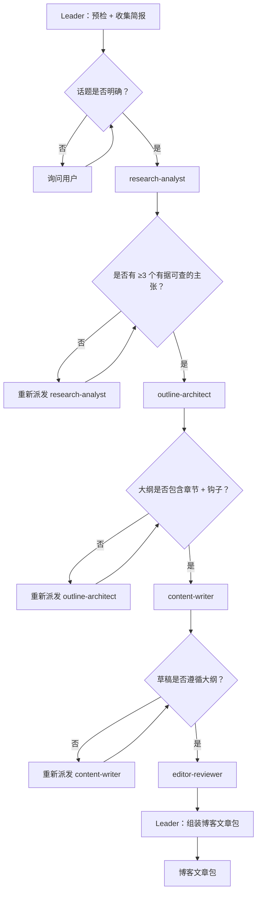

# 工作流：4 阶段博客文章流水线 → 可发布的成品

## 概览



## 详细步骤

### 步骤 0 — 预检：依赖核实

- **执行者**：Leader
- **输入**：[dependencies.yaml](dependencies.yaml)
- **输出**：预检报告；由用户决定是否继续

### 步骤 1 — 收集简报

- **执行者**：Leader
- **输入**：用户请求
- **操作**：确认话题、目标受众、目标字数、必须包含的要点、语气/风格、SEO 关键词。话题缺失 → 先询问用户再继续。
- **输出**：结构化简报
- **质量门控**：话题 + 受众 + 语气在派发前必须明确

### 步骤 2 — 调研（阶段 1）

- **执行者**：research-analyst
- **输入**：结构化简报
- **操作**：识别文章将提出的 3–7 个核心主张；为每个主张寻找支持证据、数据、案例或专家观点；评估来源可信度
- **输出**：符合 `## Output Schema` 的调研基础
- **串行 / 并行**：串行
- **质量门控**：≥3 个有证据支撑的主张 + "可信度注释"部分。不足 → 重新派发（最多重试 1 次）

### 步骤 3 — 大纲（阶段 2）

- **执行者**：outline-architect
- **输入**：调研基础 + 简报
- **操作**：创建包含 3 个标题选项、引言钩子概念、各节标题及 1 行目的说明、每节关键要点、结论/CTA 类型的大纲
- **输出**：符合 `## Output Schema` 的结构化大纲
- **串行 / 并行**：串行
- **质量门控**：≥3 个正文章节附目的说明 + 一个结论。章节缺失 → 重新派发（最多重试 1 次）

### 步骤 4 — 草稿（阶段 3）

- **执行者**：content-writer
- **输入**：已批准的大纲 + 调研基础 + 简报
- **操作**：撰写完整草稿。每节必须遵循大纲。每个核心主张有调研支撑。字数在目标值的 80–120% 之间。
- **输出**：完整草稿
- **串行 / 并行**：串行
- **质量门控**：草稿结构与大纲章节标题一致；字数在目标值的 80–120% 之间。结构偏差 → 重新派发（最多重试 1 次）

### 步骤 5 — 编辑（阶段 4）

- **执行者**：editor-reviewer
- **输入**：完整草稿 + 调研基础
- **操作**：为清晰度编辑，删减冗余（目标：减少 15–20% 字数），核查与调研的事实一致性，强化开篇钩子，验证结论
- **输出**：编辑后的草稿 + 符合 `## Output Schema` 的编辑摘要
- **串行 / 并行**：串行
- **质量门控**：编辑后字数 ≤ 原稿的 90%；编辑摘要必须标注任何事实不一致

### 步骤 6 — 最终：输出博客文章包

- **执行者**：Leader
- **输入**：编辑后的草稿 + 编辑摘要 + 调研笔记 + 大纲
- **输出**：博客文章包

#### 最终报告格式

```markdown
# 博客文章包

## 最终草稿
[编辑后的博客文章——可直接发布]

## 编辑摘要
- 删减字数：[原始 → 最终字数]
- 钩子修订：[是/否 + 修改内容]
- 发现的事实问题：[清单或"无"]

## 标题选项
1. [选项 1]
2. [选项 2]
3. [选项 3]

## 调研笔记（用于事实核查）
- [主张]：[来源/证据]
```

## 验收标准

- 4 个阶段均已完成并通过质量门控。
- 最终草稿遵循已批准的大纲结构。
- 每个核心主张均有调研输出支撑。
- 编辑后草稿短于原始草稿。
