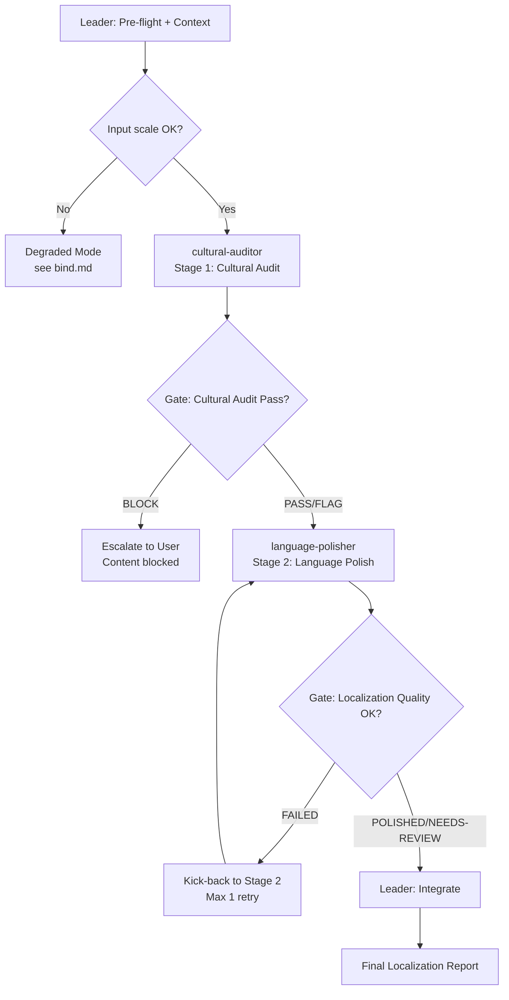

# Workflow: Localization Pipeline

## Overview



This is a **C-pattern (specialization pipeline)** team. The value is enforced discipline at handoffs: cultural risks must be identified and resolved before language polishing begins. Blurring stage boundaries (e.g., the polisher flagging cultural issues, or the auditor rewriting text) causes regressions — content that is "safe but awkward" or "smooth but offensive."

## Detailed Steps

### Step 0 — Pre-flight: dependency check

- **Executor**: Leader
- **Input**: [dependencies.yaml](dependencies.yaml)
- **Action**: verify each `skills[]` and `tools[]` entry is available
- **Output**: pre-flight report to user
- **Quality gate**: user decides go/no-go on missing items (Agent does NOT auto-decide)

### Step 1 — Cultural Audit

- **Executor**: cultural-auditor
- **Input**: source content, target locale, source locale (optional)
- **Action**: identify cultural risks (taboos, sensitivities, stereotypes, humor that may land poorly), classify by severity, suggest alternatives
- **Output**: Cultural Audit Report with risks, alternatives, and verdict (PASS / FLAG-AND-PROCEED / BLOCK-AND-ESCALATE)
- **Serial / Parallel**: Serial (Stage 1)
- **Quality gate**: 
  - **Pass criteria**: Audit Report contains at least 1 risk identified (or explicit "no risks found after deep examination" with justification), verdict is one of {PASS, FLAG-AND-PROCEED, BLOCK-AND-ESCALATE}, all risks have locale-specific context.
  - **Fail action**: if output is malformed (missing verdict or context), re-dispatch with schema explicitly inlined. Max 1 retry. On 2nd failure, mark as `[AUDITOR FAILED]` and escalate to user.

### Step 2 — Language Polish

- **Executor**: language-polisher
- **Input**: culturally-cleared content (source content with auditor's alternatives applied if FLAG), target locale, auditor's verdict
- **Action**: transform content into natural, locally-resonant prose; convert idioms/puns/metaphors to target-culture equivalents; preserve core message and emotional intent
- **Output**: Localized Content with adaptations, preservation notes, quality scores, and verdict (POLISHED / NEEDS-REVIEW / FAILED-TO-LOCALIZE)
- **Serial / Parallel**: Serial (Stage 2, only after Stage 1 gate passes)
- **Quality gate**:
  - **Pass criteria**: Localized Content is present, at least 1 adaptation documented (or explicit "already native-compatible" with justification), quality scores are all ≥3, verdict is one of {POLISHED, NEEDS-REVIEW, FAILED-TO-LOCALIZE}.
  - **Fail action**: if FAILED-TO-LOCALIZE or quality scores <3, kick back to Stage 2 with explicit feedback on what failed. Max 1 retry. On 2nd failure, mark as `[POLISHER FAILED]` and proceed with partial output in final report.

### Step 3 — Final: emit Localization Report

- **Executor**: Leader
- **Input**: Cultural Audit Report (Stage 1), Localized Content (Stage 2)
- **Action**: integrate outputs into a unified report; if auditor verdict was BLOCK, do NOT proceed to polisher — escalate to user with blocked content and risks; if polisher verdict was NEEDS-REVIEW, surface the review items explicitly
- **Output**: Localization Report in the format below

#### Final Report Format

```markdown
# Localization Report

## Summary
<1-3 sentence overview: what was localized, target locale, overall verdict>

## Cultural Audit Results
- **Verdict**: [PASS / FLAG-AND-PROCEED / BLOCK-AND-ESCALATE]
- **Risks Identified**: [count and severity breakdown]
- **Key Risks**: [top 3 risks with locale-specific context]
- **Alternatives Applied**: [if FLAG, which alternatives were used]

## Localization Results
- **Verdict**: [POLISHED / NEEDS-REVIEW / FAILED-TO-LOCALIZE]
- **Localized Content**: [final text ready for publication]
- **Key Adaptations**: [top 3 adaptations with rationale]
- **Quality Scores**: Fluency [1-5], Cultural resonance [1-5], Message fidelity [1-5]

## Review Items (if NEEDS-REVIEW)
- [Item 1]: [what needs human review and why]
- [Item 2]: [what needs human review and why]

## Blocked Content (if BLOCK-AND-ESCALATE)
- **Blocking Risks**: [risks with BLOCK severity]
- **Recommended Action**: [user must decide: modify source, choose different locale, or cancel]
```

## Acceptance Criteria

- All roles returned outputs matching their `## Output Schema` (no malformed responses).
- Final Report contains all mandatory sections (Summary, Cultural Audit Results, Localization Results).
- If auditor verdict was BLOCK, polisher was NOT dispatched — escalation path followed.
- If polisher verdict was NEEDS-REVIEW, review items are surfaced explicitly (not silently dropped).
- All gates passed or explicit kick-back/escalation recorded in the report.