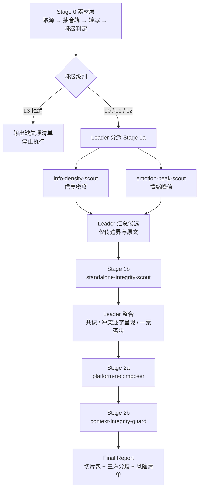

# workflow.md — 完整执行手册

## Overview

两阶段混合模式：Stage 1a 两角色并行选段 → Stage 1b 独立性裁决 → Leader 整合定稿 → Stage 2a 平台重构 → Stage 2b 风险审查。



**并行度说明**：`info-density-scout` 与 `emotion-peak-scout` 严格并行且互不可见——这是多视角的核心。`standalone-integrity-scout` 是裁决角色而非选段角色，需要候选集合作为输入，故在汇总后分派；Leader 只传候选段的边界与原文，**不传前两者的评分与理由**，以保持其判断独立。Stage 2 内部为顺序依赖：守卫审查的对象包含重构师改写的钩子。

资源限制与反幻觉硬约束见 [bind.md](bind.md)，冲突时以 bind.md 为准。

## Detailed Steps

### Stage 0 — 素材层

目标只有一个：拿到**带时间戳的转写稿**。按 [bind.md](bind.md) § Behavioral Constraints 的判定顺序执行，结果必须如实告知用户。

**情况一：用户提供了字幕文件 → L1**

直接解析 `.srt` / `.vtt`，得到逐句的开始、结束时间与文本。停顿间隔与语速偏差可由时间戳计算。

**情况二：用户提供了链接或本地音视频 → 运行转写脚本（默认路径）**

```bash
python3 scripts/transcribe.py "{SOURCE_URL 或本地文件路径}" -o repurpose_work
```

若用户已设置 `REPURPOSE_COOKIES_BROWSER`（长期同意使用浏览器登录状态），脚本会自动带上登录状态下载。

脚本一步完成：下载音频（只下音频，不下视频）→ 压成单声道 16kHz → 在静音处切成约 10 分钟的段 → 并行上传云端转写 → 按每段真实时长拼回完整时间轴。自动使用 jiuwen 已配置的 OpenRouter / OpenAI key，无需额外配置。

运行前告诉用户：「音频约 X 分钟，使用云端转写，预计一两分钟、费用约 $Y」。脚本开头会打印时长与预计费用。

产出（`repurpose_work/` 下）：

| 文件 | 内容 | 给谁用 |
|---|---|---|
| `transcript.json` | 逐句 `{id, start, end, text}`，时间单位秒 | Stage 1a 两个选段角色（作为 `{TRANSCRIPT}`） |
| `prosody.json` | 每句的停顿间隔、语速偏差百分比、笑声标记 | `emotion-peak-scout`（作为 `{PROSODY_MARKERS}`） |
| `transcript.srt` | 同内容的字幕格式 | 给用户人工核对 |
| `meta.json` | 时长、服务商、模型、实际花费、耗时 | 报告「素材层状态」 |
| `audio.mp3` | 压缩后的音频 | 用户切片时参考 |

退出码处理：

| 退出码 | 含义 | 处理 |
|---|---|---|
| 0 | 成功 | 进入 Stage 1 |
| 3 | 没有可用的云端转写服务 | 检查本地 ASR；有则**先报预计耗时并等确认**后本地转写，没有则询问用户是否有字幕或文字稿 |
| 4 | 平台拒绝访问（412 / 403） | 按约束 10 问用户一次是否使用其浏览器登录状态；同意则加 `--cookies-from-browser chrome` 重跑。不得换接口、伪装身份绕过 |
| 其他 | 缺 ffmpeg / yt-dlp、音频无人声等 | 原样告知用户错误信息，不安装任何东西 |

**不要为了省转写去找平台字幕**，也不要用 gpt-4o-audio 这类对话模型听音频来给时间码（结果是估计值，不可靠）。

**情况三：只有无时间戳文字稿 → L2**

此后全流程禁止输出任何 `HH:MM:SS` 格式字符串，切片边界改用原文首尾句引用表达。

**情况四：什么都没有 → L3**

输出缺失项清单与补齐指引，停止执行，不产出切片方案。

**本地转写（仅在云端不可用且用户确认后）**

```bash
whisper-cli -m ggml-small.bin -f repurpose_work/audio.mp3 -l zh -oj          # 最快
whisper repurpose_work/audio.mp3 --model small --language zh --output_format json   # 兜底
```

模型默认 `small`。本地转写后需自行由时间戳计算停顿间隔与语速偏差，作为 `{PROSODY_MARKERS}`。

进入 Stage 1 前，Leader 必须确定并向用户声明：`{DEGRADE_LEVEL}`、`{HAS_VIDEO}`、`{CONTENT_TYPE}`、`{SOURCE_MINUTES}`（源时长）、`{USER_CLIP_COUNT}`（用户指定的切片数；**未指定时填「由内容决定」，不要替用户设一个默认数字**）。

### Stage 1a — 并行选段

两个 teammate **必须并行且互相不可见**。不得把任一角色的输出传给另一角色。

分派模板（两者在同一条消息内发出）：

```
[粘贴 roles/info-density-scout.md 的 ## Inline Persona for Teammate 全文]

{TRANSCRIPT}: （转写全文）
{CONTENT_TYPE}: 播客
{USER_CLIP_COUNT}: 由内容决定
{SOURCE_MINUTES}: 62
{DEGRADE_LEVEL}: L0
```

```
[粘贴 roles/emotion-peak-scout.md 的 ## Inline Persona for Teammate 全文]

{TRANSCRIPT}: （转写全文）
{PROSODY_MARKERS}: （Stage 0 计算出的停顿间隔 / 语速偏差 / 笑声标记 / 音量分析；L2 时写"未提供"）
{USER_CLIP_COUNT}: 由内容决定
{SOURCE_MINUTES}: 62
{DEGRADE_LEVEL}: L0
```

> Leader 在分派前必须读取对应的 `roles/*.md` 并提取 `## Inline Persona for Teammate` 章节全文粘贴进 prompt。大多数 adopting agent 不会自动加载角色文件。

### Stage 1b — 独立性裁决

Leader 汇总前两者的候选段落，**只传段落本身（边界与原文），不传评分与理由**。

```
[粘贴 roles/standalone-integrity-scout.md 的 ## Inline Persona for Teammate 全文]

{FULL_CONTEXT_SUMMARY}: （整期主题、说话人身份、贯穿全篇的前提）
{CANDIDATE_SEGMENTS}: （去重后的候选段落，每条附前后各约 1000 字上下文窗口；仅含边界与原文，不含评分）
{DEGRADE_LEVEL}: L0
```

> **不要传转写全文。** 本角色只裁决已选出的候选段，Leader 负责为每个候选段裁出前后各约 1000 字的窗口。窗口用于识别紧邻的限定语与转述标记，`{FULL_CONTEXT_SUMMARY}` 兜住全局前提。传全文会让本阶段的输入量翻数倍而不提升判断质量。

### Integration — Leader 整合定稿

**规则 1 · 共识优先** — ≥2 个角色标记同一时间区间（重叠 ≥ 60%）→ 直接进入定稿池。

**规则 2 · 冲突逐字呈现，绝不调解** — 这是本团队最重要的规则，也是交付给用户的核心价值。

冲突判定方式：

- `info-density-scout.rejected_high_emotion_segments` 命中 `emotion-peak-scout.candidates` → 一处冲突
- `emotion-peak-scout.rejected_dense_segments` 命中 `info-density-scout.candidates` → 一处冲突
- 两者都提交同一区间但评分方向相反 → 一处冲突

每处冲突必须写入 Final Report 的「三方分歧」节，**逐字引用双方原话**。

**Leader 不得给出倾向性结论。**禁止措辞：「综合来看应选 X」「建议优先 Y」「Z 的意见更合理」「权衡后取 X」。该权衡属于人类决策。Leader 只能陈述选任一方的后果，陈述后果不等于给结论。

**规则 3 · 一票否决** — `standalone-integrity-scout` 判定 `WILL_BE_MISREAD` 且 `minimal_setup_line` 与 `suggested_boundary_fix` 均无法解决的段落，移出定稿池并说明原因。该否决权不受另外两个角色的高分影响。

**规则 4 · 边界取并集** — 起止点不一致时先取最宽边界，再由 `suggested_boundary_fix` 收窄。

**规则 5 · 按质量定条数** — 条数是结果，不是目标。

- **用户未指定时**：满足以下任一条件、且未被一票否决的段落全部进入定稿——① ≥2 个角色选中；② 仅 1 个角色选中但得分 ≥ 80。达标几段就是几段，**不得为了"看起来够多"而补入不达标段落，也不得因为"太多了"而丢弃达标段落**（硬上限除外）。
- **用户指定了 N 条时**：按共识数排序（2 票 > 1 票），同票按 `density_score` 与 `peak_score` 之和排序，取前 N。达标不足 N 条时如实说明，不凑数。
- **硬上限 12 条**：超过时按上述排序截断，并在报告中说明截掉了哪些。上限只为控制后续加工的耗时。

Final Report 的「定稿切片」标题下必须写一行**数量说明**，例如：「本期共 4 段达标。其余候选或信息量不足，或脱离上下文会被误解，见『被否决的候选』。」

**规则 6 · 裁上下文窗口** — 分派 Stage 1b 与 Stage 2b 前，Leader 负责从转写中裁出所需片段，**不要把转写全文转发给下游角色**：

- Stage 1b：每个候选段 + 前后各约 1000 字
- Stage 2b：每条定稿切片 + 前后各约 500 字

只有 Stage 1a 的两个选段角色需要全文——它们要在全篇里找段落。其余角色都是对已选出的片段做裁决，传全文只增加开销不提升质量。

**规则 7 · 分配 clip_id** — 按时间顺序分配 `clip_01`、`clip_02`……两位零填充。

### Stage 2 — 加工与审查

顺序依赖：2a 完成后再分派 2b。两者仍互不可见——重构师不知道自己会被如何审查，因此不会预先自我审查。

**Stage 2a**：

```
[粘贴 roles/platform-recomposer.md 的 ## Inline Persona for Teammate 全文]

{FINAL_CLIPS}: （定稿切片列表：clip_id、时间码、core_claim、hook_line）
{TARGET_PLATFORMS}: （用户指定的平台；未指定时填「抖音, 小红书, 视频号」三个默认主力）
{BRAND_TONE}: （品牌调性与禁用词，无则写"未指定"）
{HAS_VIDEO}: true
{DEGRADE_LEVEL}: L0
```

**Stage 2b**：

```
[粘贴 roles/context-integrity-guard.md 的 ## Inline Persona for Teammate 全文]

{FINAL_CLIPS}: （定稿切片列表）
{RECOMPOSER_OUTPUT}: （Stage 2a 的完整输出）
{CLIP_SOURCE_TEXT}: （每条切片对应的转写原文片段，含前后各约 500 字上下文）
{DEGRADE_LEVEL}: L0
```

> **不要传转写全文。** 守卫的工作是逐条比对切片原文与改写文，只需要每条切片对应的原文片段。

裁决处理：`BLOCK` → 移出交付列表，写入风险清单；`REWRITE_REQUIRED` → 保留切片，同时展示原钩子与 `required_fix`，Leader 可按要求给出修正并标注「已按守卫要求修正」；`PASS` → 正常交付。

### Final Report 格式

```markdown
## 拆条方案报告

### 素材层状态
- 运行级别：L0 全自动 / L1 半自动 / L2 降级（无时间码）/ L3 拒绝
- 转写来源：ASR / 用户字幕 / 用户文字稿
- 源时长：（仅 L0/L1 给出）
- 韵律判据可用性：（prosody_available 及其来源）

### 定稿切片（N 条）

数量说明：（为什么是这个数——达标几段、截断或不足的原因）

#### clip_03 · 00:32:10–00:33:40 （90 秒）
- 核心主张：{core_claim}
- 钩子：{hook_rewrite}
- 封面文案：{cover_copy}
- 竖屏构图：{vertical_framing}（纯音频源写"不适用"）
- 独立性：{standalone_verdict}（NEEDS_SETUP 时附 minimal_setup_line）
- 守卫裁决：PASS / REWRITE_REQUIRED / BLOCK — {required_fix}
- 切割命令：`ffmpeg -ss 00:32:10 -to 00:33:40 -i {SOURCE_FILE} -c copy clip_03.mp4`
  （`{SOURCE_FILE}` 为用户本地的原始视频。若用户本地没有视频文件，在命令上方注明「需先自行下载源视频」——本技能不代为下载）

### 三方分歧（人类决策区）

> **信息密度评估员**：「（原话）」
> **情绪峰值评估员**：「（原话）」
> 选任一方的后果：（陈述后果，不给结论）

### 被否决的候选
段落 + 否决原因（多为 WILL_BE_MISREAD，附 misread_risk 原文）

### 平台分发矩阵
切片 × 目标平台的 fit_score 表，低于 40 的格子标注原因

### 风险清单
BLOCK / REWRITE_REQUIRED 条目，每条附 evidence_original 与 evidence_rewritten 对照
```

L2 级别下的差异：删除「切割命令」行，时间码位置改为原文引用，报告开头显著标注「本次运行无时间码，需人工定位」。

## Acceptance Criteria

一次运行被视为合格，必须同时满足：

1. **降级级别已声明** — 报告开头的「素材层状态」明确给出 L0/L1/L2/L3 及转写来源。
2. **时间码可溯源** — 所有 `HH:MM:SS` 均来自 ASR 输出或字幕文件。L2 级别下报告全文不含任何 `HH:MM:SS` 字符串。
3. **L3 拒绝生效** — 无任何转写来源时不产出切片方案，即使用户催促（「你先大概给几个」）也不松动。
4. **冲突逐字呈现** — 「三方分歧」节引用双方原话，且不含 Leader 的调解结论（无「综合来看」「建议优先」「更合理」「权衡后取」等措辞）。
5. **一票否决生效** — 被判 `WILL_BE_MISREAD` 且无法补救的段落确实未进入定稿列表。
6. **守卫证据成对** — 每条裁决均给出 `evidence_original` 与 `evidence_rewritten`，`PASS` 亦然。
7. **韵律判据可溯源** — 每条 `peak_evidence` 指向真实来源（停顿秒数、语速偏差、笑声标记）；无 `{PROSODY_MARKERS}` 时 `prosody_available` 为 `false` 且不出现 `pause_tension` / `laughter` 类型。
8. **切割命令可执行** — L0 级别下，逐条运行 ffmpeg 命令切出的片段内容与报告中 `core_claim` 一致。
