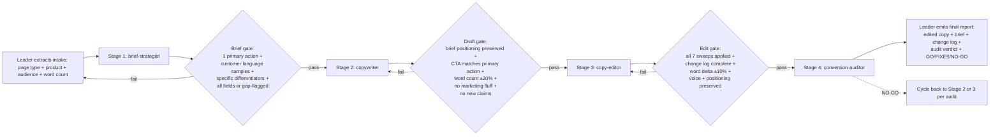

# Workflow：Intake → Brief → Draft → Edit → Conversion Audit → 可上线文案

## 总览



> **模式 C（顺序流水线）配合 4 个严格关卡**。每个阶段的产出在交接前锁定；下游阶段不得改写上游的实质内容。这些关卡是团队存在的根本理由 —— 它们阻止了单智能体最常见的失败：跳过策略，产出空泛、低转化的文案。

## 详细步骤

### 步骤 0：飞行前依赖检查（Leader，≤1 轮）

阅读 [`dependencies.yaml`](./dependencies.yaml)。验证每个声明的社区 skill。
报告缺失项。完全支持仅使用 inline-persona 的模式。

### 步骤 1：Intake 提取（Leader，≤1 轮）

Leader 不写任何文案。仅负责：

1. **页面类型** —— landing / product / pricing / about / ad / email open
2. **产品 / offer** —— 在售的是什么 + 1 行描述
3. **受众** —— 他们是谁 + 他们的问题（尽量用他们自己的话）
4. **字数目标** —— 典型值：landing 200-500 / product 300-700 / pricing 100-300 / ad 30-100
5. **品牌语境** —— 若存在 `.claude/product-marketing-context.md` 则读取它，否则用临时描述词
6. **客户原声样本** —— 来自评论 / 访谈 / 客服 / 社区的逐字引用（尽量 3-5 条；若无则标记缺口）
7. **支撑证据** —— 具体数字、署名客户、用户证言（否则标记缺口）

若 intake 太单薄（没有受众描述、没有 offer 细节），则向用户追问。不得在骨架级 intake 上强行继续。

### 步骤 2：阶段 1 —— brief-strategist（顺序）

| 子步骤 | 角色 | 输入 | 输出 | 角色文件 |
|---|---|---|---|---|
| **2** | brief-strategist (×1) | Intake | 结构化 brief：页面目的 / 受众 / offer / 语境 / 约束 / 反模式标记 / 未决缺口 | [`roles/brief-strategist.md`](./roles/brief-strategist.md) |

**Brief Gate**（Leader 在进入阶段 2 前强制执行）：
- ✓ 定义了"唯一的"主要行动（而非多个）
- ✓ 客户原声样本齐备（3-5 条逐字），或显式 `[gap: ...]` 标记
- ✓ 1-2 条具体差异化，或显式 `[gap: ...]` 标记
- ✓ 所有必填字段已填，或带显式 `[gap: ...]` 标记
- ✓ 已明确字数目标

**关卡失败处理**：若 brief 不完整或存在多个主要行动，**不得**进入阶段 2。要么向用户追问（输入有缺口），要么带上显式提示重试 brief-strategist（方法疏漏）。

### 步骤 3：阶段 2 —— copywriter（顺序）

| 子步骤 | 角色 | 输入 | 输出 | 角色文件 |
|---|---|---|---|---|
| **3** | copywriter (×1) | Brief | 草稿 v1：hook + headline + sub-headline + body + CTA + draft meta | [`roles/copywriter.md`](./roles/copywriter.md) |

**Draft Gate**：
- ✓ 所有段落齐备（hook + headline + sub-headline + body + CTA）
- ✓ 字数在 brief 目标的 ±20% 以内
- ✓ CTA 与 brief 的主要行动完全一致
- ✓ 无营销套话："powerful"、"robust"、"seamless"、"revolutionary"、"best-in-class"、"leverage"、"synergy"
- ✓ 除 brief 支撑证据外未引入任何新主张（数字 / 客户 / 案例）
- ✓ 声音贴近客户原声样本（若 brief 标记了缺口，则为中性产品声音）

**关卡失败处理**：带上失败关卡检查点的具体提示回退到阶段 2。重试 2 次后仍失败则上报用户："草稿无法通过关卡 —— 请检查 brief 或接受当前草稿"。

### 步骤 4：阶段 3 —— copy-editor（顺序）

| 子步骤 | 角色 | 输入 | 输出 | 角色文件 |
|---|---|---|---|---|
| **4** | copy-editor (×1) | Brief + 草稿 v1 | 编辑后文案 v2 + 变更日志（7 轮） + edit meta | [`roles/copy-editor.md`](./roles/copy-editor.md) |

**Edit Gate**：
- ✓ 全部 7 轮都已执行（每一轮段落都在，即便是"no changes — already strong"）
- ✓ 变更日志完整（每条变更带 sweep + original → edited + 理由）
- ✓ 字数变化在起始字数的 ±10% 以内
- ✓ 声音 + 定位 + 主要行动保持不变
- ✓ 未引入新主张
- ✓ 如有 Sweep 0 发现，已显式标记给用户 / Leader

**关卡失败处理**：带具体提示回到阶段 3。若 editor 反复标记"Sweep 0 —— 草稿 off-brief"，上报用户，提示阶段 2 需要根据 brief 调整后重新执行。

### 步骤 5：阶段 4 —— conversion-auditor（顺序）

| 子步骤 | 角色 | 输入 | 输出 | 角色文件 |
|---|---|---|---|---|
| **5** | conversion-auditor (×1) | Brief + 编辑后文案 v2 + 变更日志 | 审计：6 个检查点打分 + 最终签发（GO / GO-WITH-FIXES / NO-GO） | [`roles/conversion-auditor.md`](./roles/conversion-auditor.md) |

**审计结果**：

| 签发结论 | 动作 |
|---|---|
| **GO** | 进入步骤 6（Leader 原样输出最终报告） |
| **GO-WITH-FIXES** | 向用户上报 ≤ 5 条具体修复项；用户可原样上线并手动应用修复，或带修复清单回到阶段 3 |
| **NO-GO** | 上报回退建议（阶段 1/2/3）；团队**不得**输出"可上线"报告；由用户决定是否重试 |

### 步骤 6：最终报告（Leader）

Leader 不修改任何角色的产出。

```markdown
## Marketing Copy Team Output

> Page: {PAGE_TYPE} for {PRODUCT} · Word count target: {N} · Total runtime: {T} min

---

### 🚦 Sign-off (from Conversion Auditor)
- **GO / GO-WITH-FIXES / NO-GO**
- Reasoning: ...

### ✍️ Final Copy
[Edited copy v2 verbatim — paste-ready]

### 🔧 Required Fixes (if GO-WITH-FIXES, ≤ 5)
1. ...

### 🔁 Cycle-back recommendation (if NO-GO)
- Cycle back to: Stage {N}
- Reason: ...

### 📋 Pipeline Artifacts (collapsed)
<details><summary>Stage 1 Brief</summary>{brief verbatim}</details>
<details><summary>Stage 2 Draft v1</summary>{draft verbatim}</details>
<details><summary>Stage 3 Change Log (7 sweeps)</summary>{change log verbatim}</details>
<details><summary>Stage 4 Conversion Audit (6 checkpoints)</summary>{audit verbatim}</details>

### 📊 Pipeline Stats
- Stage 1 brief: {T1}s
- Stage 2 draft: {T2}s, {N draft retries}
- Stage 3 edit: {T3}s, {N edit retries}
- Stage 4 audit: {T4}s
- Total: {T_total}, {N total cycles}
```

## 验收标准

一次运行**仅在以下条件全部成立**时视为**成功**：

1. ✅ Brief gate 通过：唯一主要行动 + 客户原声（或标记缺口）+ 具体差异化
2. ✅ Draft gate 通过：与 brief 保真 + 字数 ±20% + 无营销套话 + 无新主张
3. ✅ Edit gate 通过：全部 7 轮已执行 + 变更日志完整 + 字数变化 ±10% + 声音保持
4. ✅ Audit 产出明确签发：GO / GO-WITH-FIXES / NO-GO 并附理由
5. ✅ 对于 GO/GO-WITH-FIXES：最终文案可粘贴即用
6. ✅ 对于 NO-GO：回退建议明确，无误报的"可上线"结论
7. ✅ 总时钟时间 < 12 分钟（对典型落地页文案而言）
