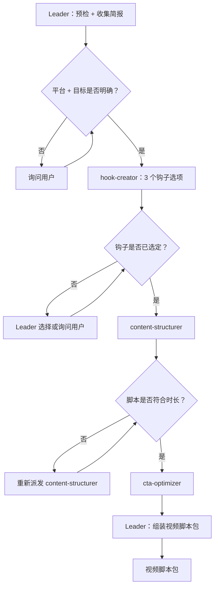

# 工作流：3 阶段短视频脚本流水线 → 钩子优先的脚本

## 概览



## 详细步骤

### 步骤 0 — 预检：依赖核实

- **执行者**：Leader
- **输入**：[dependencies.yaml](dependencies.yaml)
- **输出**：预检报告；由用户决定是否继续

### 步骤 1 — 收集简报

- **执行者**：Leader
- **输入**：用户请求
- **操作**：确认平台（TikTok/Reels/Shorts）、目标受众、视频目标（认知/涨粉/点击/销售）、目标时长（15s/30s/60s）、话题、核心信息、语气。平台 + 目标缺失 → 询问用户。
- **输出**：结构化视频简报
- **质量门控**：平台 + 目标 + 话题 + 时长在派发前必须全部明确

### 步骤 2 — 钩子创作（阶段 1）

- **执行者**：hook-creator
- **输入**：视频简报
- **操作**：为开场前 3–5 秒撰写 3 个各具特色的钩子选项。每个：具体技巧（问题/大胆主张/打破预期/共鸣场景）、≤15 个词、3–5 秒内可说完。
- **输出**：符合 `## Output Schema` 的 3 个钩子
- **串行 / 并行**：串行
- **质量门控**：3 个钩子均存在，各 ≤15 个词，各附技巧标签 + 理由。不足 → 重新派发（最多重试 1 次）

**Leader 操作**：根据理由选出最强钩子，或将全部 3 个提供给用户选择。未选定钩子前**不得**进入阶段 2。

### 步骤 3 — 内容结构（阶段 2）

- **执行者**：content-structurer
- **输入**：已批准的钩子 + 视频简报
- **操作**：以已批准的钩子作为开场撰写中间段脚本。包含节奏标记（`[2s]`、`[cut]`），超过 30 秒的视频至少 1 处打破节奏，结尾处的 CTA 前留存线。
- **输出**：符合 `## Output Schema` 的完整脚本草稿
- **串行 / 并行**：串行
- **质量门控**：字数符合目标时长（约 2.5 词/秒）。超过目标值 120% → 重新派发并附字数限制（最多重试 1 次）

### 步骤 4 — CTA 优化（阶段 3）

- **执行者**：cta-optimizer
- **输入**：完整脚本草稿 + 视频目标 + 简报
- **操作**：评审结尾 5–10 秒；重写/确认 CTA 以匹配视频目标；提供 2 个 CTA 变体（强力直接版 / 温和间接版）
- **输出**：符合 `## Output Schema` 的优化 CTA + 2 个变体
- **串行 / 并行**：串行
- **质量门控**：口播 CTA ≤10 个词；明确匹配既定目标。不匹配 → 重新派发（最多重试 1 次）

### 步骤 5 — 最终：输出视频脚本包

- **执行者**：Leader
- **输入**：已批准的钩子 + 内容结构 + 优化 CTA
- **输出**：视频脚本包

#### 最终报告格式

```markdown
# 视频脚本包

## 平台与目标
- 平台：[TikTok / Reels / Shorts]
- 目标：[认知 / 涨粉 / 点击 / 销售]
- 目标时长：[X 秒]

## 完整脚本
[00:00] [钩子]
[00:03] [中间内容附节奏标记]
[00:XX] [CTA]

## 钩子选项（全部 3 个——用于 A/B 测试）
1. [钩子] — 技巧：[类型] — [理由]
2. ...
3. ...

## CTA 变体
- 强力直接版：[CTA]
- 温和间接版：[CTA]

## 制作说明
- 预计时长：正常语速约 ~[X] 秒
- 节奏中断位置：[时间戳]
```

## 验收标准

- 3 个阶段均已完成并通过质量门控。
- 选定的钩子 ≤15 个词且注明了技巧。
- 总脚本字数不超过目标时长字数的 120%。
- CTA 明确匹配既定视频目标。
