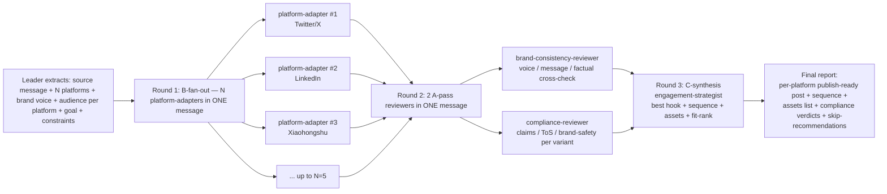

# Workflow：源信息 + N 个平台 → B 适配 → 2 个 A 复核并行 → C 制定策略 → 可发布内容包

## 总览



## 详细步骤

### Step 0：起飞前（Leader，≤1 轮）

阅读 `dependencies.yaml`。报告缺失项。支持仅 inline-persona 模式。

### Step 1：活动上下文提取（Leader，≤1 轮）

Leader 收集：

1. **源信息**——粘贴 / 链接到权威版本
2. **N 个目标平台**——3-5 个（若 > 5，要求优先排序）；默认支持：Twitter/X、
   LinkedIn、小红书 (Xiaohongshu)、Instagram、Reddit、Threads、Mastodon、Bluesky、Facebook、
   TikTok-script、WeChat-公众号、微博 (Weibo)。对于不受支持的平台，由用户提供
   语气画像。
3. **品牌语气指南**——链接 / 粘贴 / "使用默认值"
4. **每个平台的受众**——用户在每个平台上实际拥有的受众（LinkedIn 上的 CTO，
   Twitter 上的独立开发者，等等）
5. **活动目标**——知名度 / 注册 / 互动 / 销售 / 社群建设
6. **发布时间窗**——同日 / 错开 / 滴灌；影响发布顺序
7. **KPI**——驱动 strategist 的 hook 选择（点击 vs 回复 vs 收藏 vs 分享）
8. **硬性约束**——必须包含 / 必须排除的要素

**跳过团队的条件**：
- 仅 1-2 个平台 → 使用单 Agent 的 platform-writer
- 没有源信息 → 跳转（"请先写好源信息再适配"）
- 纯付费广告文案 → 跳转至 paid-ads-team（TODO）
- 长篇内容写作（博客 / 文章） → 使用内容写作类技能

### Step 2：Round 1——B 扩散 N 个 platform-adapter（Leader，一次性派发 N 个调用）

Leader **必须在一条消息中发起所有 N 个 Task 调用**。每个调用携带：源信息 + 品牌
语气 + 该平台受众 + 硬性约束 + 角色的 inline persona（注入该
平台特定的语气画像）。

| 子步骤 | 角色 | 输入 | 输出 | 角色文件 |
|---|---|---|---|---|
| **2.1..N** | platform-adapter × N | 源信息 + 品牌语气 + 平台受众 + 约束 + 平台名称 | 适配后的帖子（平台原生长度/格式）+ 3 个 hook 变体 + 每个选择对应的平台惯例 | [`roles/platform-adapter.md`](./roles/platform-adapter.md) |

**每个适配器的质量校验门**（未达标时重试一次）：
- 长度在平台的典型范围内
- 格式符合平台惯例（Twitter 上长内容用 thread；IG 用 carousel-script；小红书用笔记格式）
- 3 个彼此不同的 hook 变体（不是相互之间的小改）
- 话题标签使用符合平台常规（LinkedIn 正式帖不用；IG 3-5 个；小红书 1-3 个；Twitter 0-2 个）
- 硬性约束被遵守
- 输出中不做跨平台对比（这是 B 模式车道之外的事）

如果适配器产出"统一化语气"（LinkedIn 版的帖子读起来与 Twitter 版一模一样）→ 带平台语气提示重试一次。

### Step 3：Round 2——2 个 A 复核并行（Leader，一次性派发 2 个调用）

Leader 在一条消息中派发两位 reviewer，并附上全部 N 份变体。

| 子步骤 | 角色 | 输入 | 输出 | 角色文件 |
|---|---|---|---|---|
| **3a** | brand-consistency-reviewer | 全部 N 份变体 + 品牌语气指南 + 源信息 | 一致性判定 {Consistent / Drift-Detected / Inconsistent} + 逐变体漂移点 + 对齐修订 | [`roles/brand-consistency-reviewer.md`](./roles/brand-consistency-reviewer.md) |
| **3b** | compliance-reviewer | 全部 N 份变体 + 平台 ToS 摘要 + 行业上下文 | 逐变体判定 {OK / EDIT-REQUIRED / BLOCK} + 具体修订 + 风险依据 | [`roles/compliance-reviewer.md`](./roles/compliance-reviewer.md) |

**质量校验门**：
- brand-consistency-reviewer：在语气 + 信息 + 事实三个维度上给出明确的逐变体漂移说明（或"无漂移"）
- compliance-reviewer：对 N 份变体逐一给出判定；不得在未做逐变体检查时给出笼统 OK

如果 compliance-reviewer 对某个变体给出 BLOCK → 该平台从可发布包中排除；告知 strategist。

### Step 4：Round 3——C 综合 engagement-strategist（Leader，单次调用）

Leader 将所有变体 + 两份 A 复核结论传递给 engagement-strategist。输出：

1. **每平台最佳 hook**——基于平台特定的互动先验从 3 个变体中挑选
2. **发布顺序**——顺序 + 时间建议（哪个平台先发；间隔；交叉推广提及）
3. **每平台素材 / 图片 / 链接需求**——每条帖子需要什么（thread 卡片、OG 图、视频片段、alt-text、可访问性考量）
4. **契合度排名**——内容契合度最高的前 2 个平台（值得用付费投放或 KOL 推送放大）+ 在预算紧张时考虑跳过的末位 1 个平台

**质量校验门**：
- 对每个未被 BLOCK 的平台都挑选出最佳 hook，并给出平台特定的理由
- 顺序要有明确的排序 + 间隔时间
- 每平台有素材清单
- 契合度排名要明确

禁止：引入新内容；重写变体；覆盖合规 BLOCK 的决定。

### Step 5：最终报告（Leader）

```markdown
## Social Media Multi-Platform Team Output

> Source: {paste excerpt} · Platforms: {N} · Goal: {GOAL} · Total runtime: {T} min
> Compliance summary: {N OK / N EDIT / N BLOCKED} · Brand consistency: {STATUS}

---

### 📅 Posting Sequence
1. **{Platform A}** at T+0
2. **{Platform B}** at T+{gap} — cross-promote with {handle / link / thread reference}
3. ...

### 🎯 Per-Platform Publish-Ready Posts

#### {Platform 1}
**Status**: {READY / EDIT-REQUIRED / BLOCKED — reason}

**Final post**:
> {final adapted post with chosen hook applied + edits from A-pass applied}

**Hook variant chosen**: #{1/2/3} — Why: {1 sentence platform-specific reason}

**Other hook variants (for A/B if you want)**:
- Variant 2: ...
- Variant 3: ...

**Assets needed**:
- {image / thread card / OG / video clip / alt-text}

**Compliance verdict**: {OK / EDIT-REQUIRED — specific edits / BLOCK — reason}

#### {Platform 2}
[same structure]

[... per platform ...]

### 🎯 Fit Ranking (worth amplifying ↔ skip-candidate)
1. **Top fit**: {platform} — Why: {1 sentence}
2. **Top fit #2**: {platform} — Why: {1 sentence}
3. **Skip-candidate**: {platform} — Why: {1 sentence — only if budget-constrained}

### 🎨 Brand-Consistency Notes
{Verbatim brand-consistency-reviewer findings + edits applied}

### ⚖️ Compliance Notes
{Verbatim compliance-reviewer per-variant verdicts + edits applied + BLOCK rationale}

---

### 📑 Per-Role Appendix (verbatim)
- Platform Adapter outputs (N) — verbatim
- Brand-Consistency Reviewer — verbatim
- Compliance Reviewer — verbatim
- Engagement Strategist — verbatim
```

## 验收标准

当且仅当满足下列全部条件时，一次运行为**成功**：

1. ✅ N 个 platform-adapter 已运行（或在 1 个失败且 ≥ 3 个成功时带告示条）
2. ✅ 每个变体的长度 / 格式符合其平台惯例
3. ✅ 每个变体有 3 个彼此不同的 hook 变体（不是小改）
4. ✅ brand-consistency-reviewer 给出了明确的逐变体漂移说明
5. ✅ compliance-reviewer 对 **所有 N** 个变体都给出了逐变体判定 {OK / EDIT-REQUIRED / BLOCK}
6. ✅ engagement-strategist 为每个未被 BLOCK 的平台都挑选了最佳 hook，并给出平台特定的理由
7. ✅ 发布顺序包含时间安排 + 每平台素材清单
8. ✅ 契合度排名明确，含前 2 名 + 跳过候选
9. ✅ 被 BLOCK 的变体已从可发布包中排除
10. ✅ 对于 N=4 个平台，总时长 < 18 min
