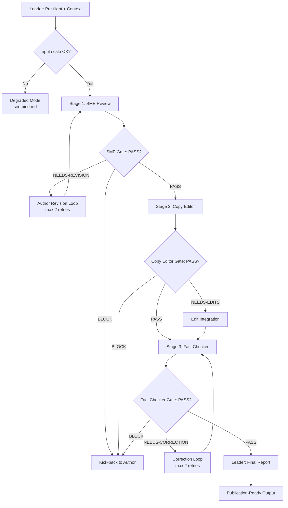

# Workflow: Technical Content Review Pipeline

## Overview



This workflow implements a **specialization pipeline (Pattern C)** inspired by O'Reilly's technical book review process. Each stage has strict handoff contracts and quality gates — blurring stage boundaries causes regressions (e.g., the editor rewriting technical explanations, the fact checker evaluating code correctness).

## Detailed Steps

### Step 0 — Pre-flight: dependency check

- **Executor**: Leader
- **Input**: [dependencies.yaml](dependencies.yaml)
- **Action**: verify each `skills[]` and `tools[]` entry is available
- **Output**: pre-flight report to user
- **Quality gate**: user decides go/no-go on missing items (Agent does NOT auto-decide)

### Step 1 — SME Technical Review

- **Executor**: subject-matter-expert
- **Input**: content under review + domain context
- **Action**: verify technical accuracy, code correctness, terminology precision
- **Output**: SME Review Report with verdict (PASS / NEEDS-REVISION / BLOCK)
- **Serial / Parallel**: Serial (first stage)
- **Quality gate**: 
  - **Pass criteria**: Verdict = PASS, or NEEDS-REVISION with specific corrections provided
  - **Fail action**: 
    - BLOCK → kick back to author with critical issues listed, halt pipeline
    - NEEDS-REVISION → author revision loop, max 2 retries, on 3rd failure escalate to user

### Step 2 — Copy Editor Review

- **Executor**: copy-editor
- **Input**: SME-approved content + SME output (for context)
- **Action**: review prose clarity, consistency, readability, structural coherence
- **Output**: Copy Editor Report with verdict (PASS / NEEDS-EDITS / BLOCK)
- **Serial / Parallel**: Serial (second stage, after SME gate passes)
- **Quality gate**:
  - **Pass criteria**: Verdict = PASS, or NEEDS-EDITS with specific edits proposed
  - **Fail action**:
    - BLOCK → kick back to author with structural issues, halt pipeline
    - NEEDS-EDITS → integrate edits into content, proceed to Stage 3

### Step 3 — Fact Checker Verification

- **Executor**: fact-checker
- **Input**: SME-approved + Copy Editor-approved content + prior stage outputs
- **Action**: verify citations, statistics, historical claims, external assertions
- **Output**: Fact Checker Report with verdict (PASS / NEEDS-CORRECTION / BLOCK)
- **Serial / Parallel**: Serial (third stage, after Copy Editor gate passes)
- **Quality gate**:
  - **Pass criteria**: Verdict = PASS, or NEEDS-CORRECTION with specific corrections provided
  - **Fail action**:
    - BLOCK → kick back to author with unverifiable claims, halt pipeline
    - NEEDS-CORRECTION → correction loop, max 2 retries, on 3rd failure escalate to user

### Step 4 — Final: emit Technical Review Report

- **Executor**: Leader
- **Input**: outputs from all three stages
- **Action**: integrate all findings, validate all gates passed, compile publication-ready verdict
- **Output**: Technical Review Report in the format below

#### Final Report Format

```markdown
# Technical Review Report

## Summary
<1-3 sentence overview of the review outcome>

## SME Findings (Technical Accuracy)
- [Issue] — [Correction] — [Status: RESOLVED / PENDING]
- ...

## Copy Editor Findings (Prose Quality)
- [Edit] — [Reason] — [Status: APPLIED / REJECTED]
- ...

## Fact Checker Findings (Citation Verification)
- [Claim] — [Verification status] — [Evidence]
- ...

## Publication Verdict
- READY-FOR-PUBLICATION / NEEDS-AUTHOR-REVISION / BLOCKED

## Gate Summary
- SME Gate: PASS / NEEDS-REVISION / BLOCK
- Copy Editor Gate: PASS / NEEDS-EDITS / BLOCK
- Fact Checker Gate: PASS / NEEDS-CORRECTION / BLOCK

## Retry History (if any)
- SME retries: <count>
- Fact Checker retries: <count>
```

## Acceptance Criteria

- All three roles returned outputs matching their `## Output Schema` (no malformed responses).
- All gates passed (PASS verdict) or explicit kick-back recorded with retry history.
- Final Report contains all mandatory sections: SME Findings, Copy Editor Findings, Fact Checker Findings, Publication Verdict, Gate Summary.
- No stage modified upstream stage outputs — each stage only annotated/enhanced.
- If any stage returned BLOCK, the pipeline halted and the Final Report documents the blocking issues.