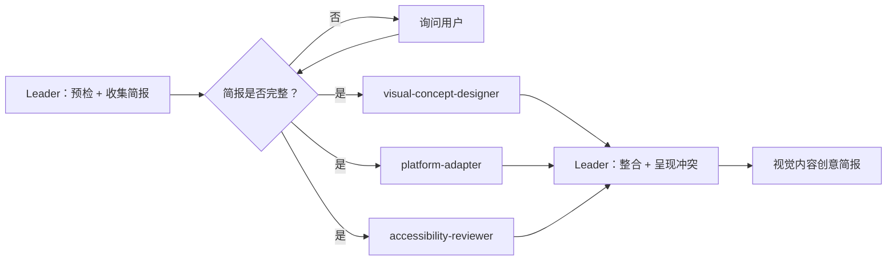

# 工作流：并行视觉内容创意简报 → 跨平台创意包

## 概览



## 详细步骤

### 步骤 0 — 预检：依赖核实
- **执行者**：Leader；由用户决定是否继续

### 步骤 1 — 收集简报
- **执行者**：Leader
- **输入**：用户请求
- **操作**：确认活动目标、目标平台（列出全部）、核心信息、目标受众、风格/基调、品牌规范（如有颜色、字体）、任何视觉限制。至少需要 1 个平台。
- **质量门控**：目标 + ≥1 个平台 + 核心信息在派发前必须全部明确

### 步骤 2 — 并行派发
- **执行者**：Leader 同时派发全部 3 个角色
- **输入**：3 个角色使用相同简报
- **各角色独立运行，不得看到彼此的输出**
- **串行 / 并行**：并行
- **质量门控**：每个角色输出必须包含所有必填部分。格式不符 → 按 [bind.md](bind.md) 重试一次

派发提示词：
```
You are the [ROLE NAME] in a Visual Content Brief Teamskill.
[PASTE INLINE PERSONA]

CONTENT BRIEF: {BRIEF}
TARGET PLATFORMS: {PLATFORMS}
```

### 步骤 3 — 整合并呈现冲突
- **执行者**：Leader
- **操作**：
  1. 检查 platform-adapter 的格式规范是否与 visual-concept-designer 的创意概念兼容
  2. 检查 accessibility-reviewer 标注的问题是否与视觉概念冲突（如对比度问题、文字易读性）
  3. 逐字呈现所有冲突——不做解决（由用户决定）
  4. 组装统一简报
- **质量门控**：简报中列出的每个平台都必须有对应的适配条目

### 步骤 4 — 最终：输出视觉内容创意简报
- **执行者**：Leader
- **输出**：视觉内容创意简报

#### 最终报告格式

```markdown
# 视觉内容创意简报

## 核心创意概念
[来自 visual-concept-designer]
- 视觉主题：[...]
- 色彩方向：[...]
- 构图创意：[...]
- 情感基调：[...]

## 各平台规格
| 平台 | 格式/尺寸 | 文案长度 | 关键适配说明 |
|---|---|---|---|
| [平台] | [如 1080×1080] | [如 ≤150 字] | [适配说明] |

## 无障碍要求
- 替代文字：[建议的 alt-text 文案]
- 对比度说明：[任何对比度要求]
- 易读性：[文字尺寸/位置指引]
- 包容性信号：[任何注意事项]

## 待解决的冲突（由人工决定）
- [概念元素]与[平台规格/无障碍要求]冲突：[角色 A 说"……"——角色 B 说"……"]

## 制作检查清单
- [ ] 以[最大所需尺寸]创建核心视觉稿
- [ ] 为每个平台调整尺寸
- [ ] 撰写替代文字
- [ ] 按平台调整文案
```

## 验收标准
- 3 个角色均已返回包含必填部分的输出。
- 每个目标平台均有对应的适配条目。
- 所有概念-无障碍冲突已逐字呈现，无一由 Leader 解决。
